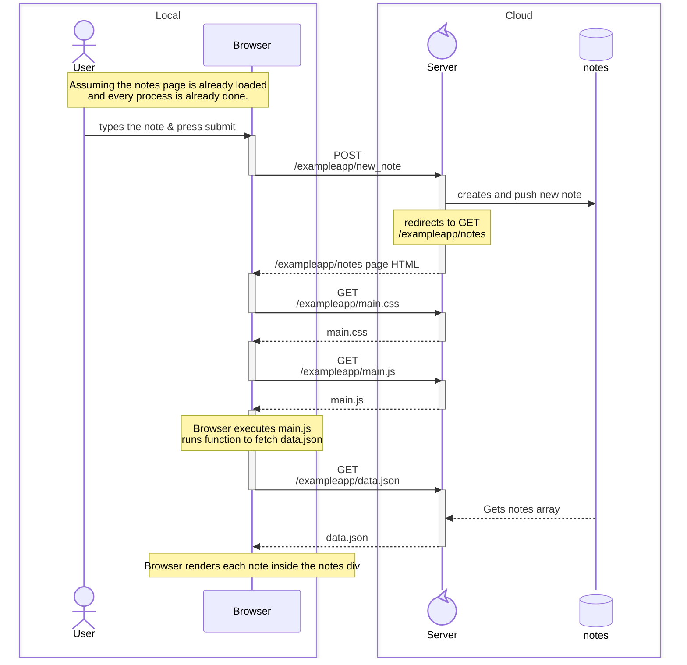

```mermaid
sequenceDiagram
    box Local
        participant u@{ type : actor, alias : User}
        participant b@{ alias : Browser}
    end
    box Cloud
        participant s@{ type : control, alias : Server}
        participant n@{ type : database, alias : notes}
    end

    Note over u,b: Assuming the notes page is already loaded <br/> and every process is already done.

    u->>b: types the note & press submit
    activate b
    b->>s: POST <br/> /exampleapp/new_note
    deactivate b

    activate s
    s->>n: creates and push new note
    Note over s: redirects to GET <br/> /exampleapp/notes
    s-->>b: /exampleapp/notes page HTML
    deactivate s

    activate b
    b->>s: GET <br/> /exampleapp/main.css
    deactivate b

    activate s
    s-->>b: main.css
    deactivate s

    activate b
    b->>s: GET <br/> /exampleapp/main.js
    deactivate b

    activate s
    s-->>b: main.js
    deactivate s

    activate b
    Note over b: Browser executes main.js <br/> runs function to fetch data.json
    b->>s: GET <br/> /exampleapp/data.json
    deactivate b

    activate s
    n-->>s: Gets notes array
    s-->>b: data.json
    deactivate s
    
    Note over b: Browser renders each note inside the notes div
```