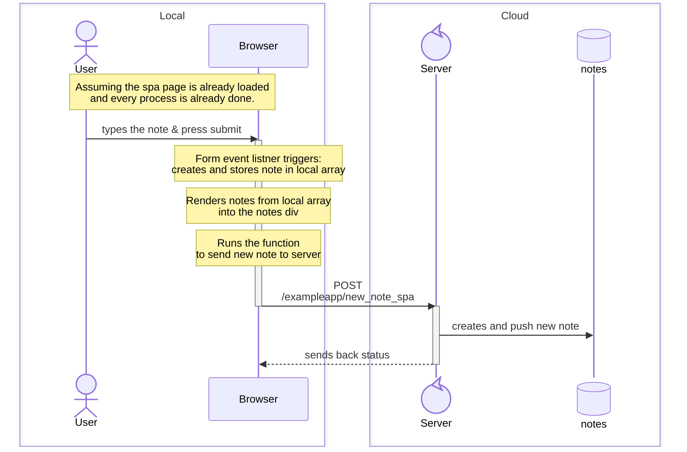

```mermaid
sequenceDiagram
    box Local
        participant u@{ type : actor, alias : User}
        participant b@{ alias : Browser}
    end
    box Cloud
        participant s@{ type : control, alias : Server}
        participant n@{ type : database, alias : notes}
    end

    Note over u,b: Assuming the spa page is already loaded <br/> and every process is already done.

    u->>b: types the note & press submit
    activate b
    Note over b: Form event listner triggers: <br/> creates and stores note in local array
    Note over b: Renders notes from local array <br/> into the notes div
    Note over b: Runs the function <br/> to send new note to server
    b->>s: POST <br/> /exampleapp/new_note_spa
    deactivate b

    activate s
    s->>n: creates and push new note
    s-->>b: sends back status
    deactivate s
```